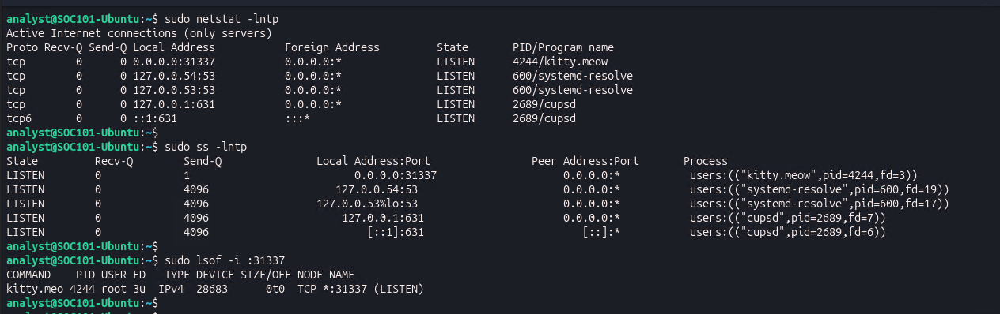
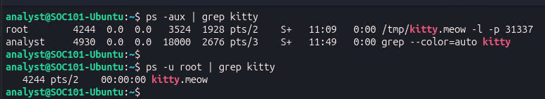
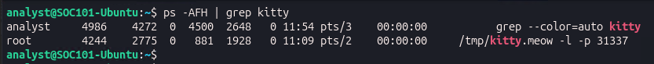
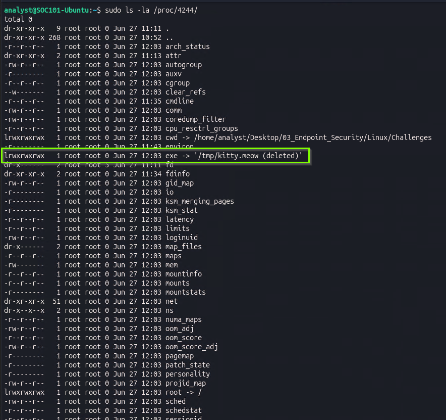
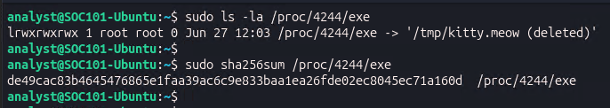
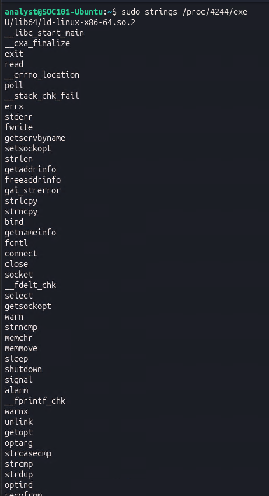
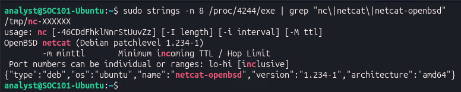
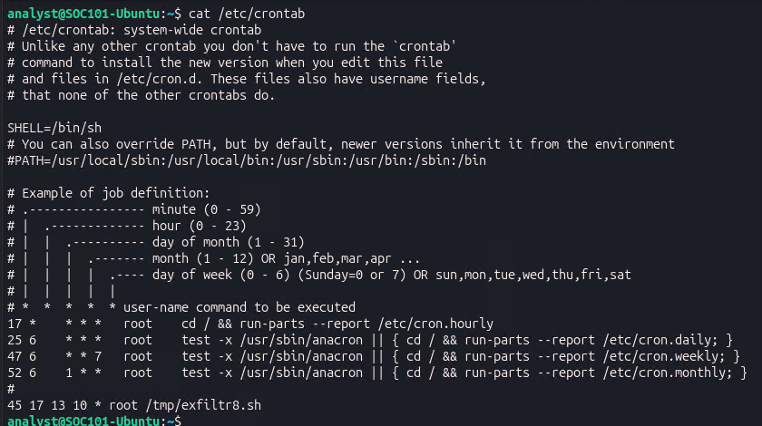

# Linux Endpoint Compromise Investigation

**Case ID:** DFIR-2026-LIN-001  
**Date:** 2026-06-27  
**Analyst:** Miro Lerch  
**Classification:** Confidential - Internal IR Use Only  
**Status:** Remediated

---

## Table of Contents

1. [Executive Summary](#executive-summary)
2. [Scenario & Scope](#scenario--scope)
3. [Tools Used](#tools-used)
4. [Investigation Timeline](#investigation-timeline)
5. [Phase 1 - Network Listener Discovery](#phase-1--network-listener-discovery)
6. [Phase 2 - Process Analysis](#phase-2--process-analysis)
7. [Phase 3 - Malware Identification via SHA-256 & String Analysis](#phase-3--malware-identification-via-sha-256--string-analysis)
8. [Phase 4 - Cron Job Persistence Analysis](#phase-4--cron-job-persistence-analysis)
9. [IOC Summary](#ioc-summary)
10. [MITRE ATT&CK Mapping](#mitre-attck-mapping)
11. [Detection Opportunities](#detection-opportunities)
12. [Incident Response Actions](#incident-response-actions)

---

## Executive Summary

A Linux server was flagged for investigation after exhibiting signs of compromise. Analysis identified an active network backdoor running as root, disguised as a benign process (`kitty.meow`), listening on a non-standard port. Static analysis of the binary confirmed it was a renamed `netcat` (OpenBSD variant) used to establish a persistent listener. A malicious cron job was also discovered in the system-wide crontab, configured to execute a data exfiltration script on a specific date. Both persistence mechanisms were documented and removed.

---

## Scenario & Scope

A compromised Linux server was assigned for investigation as part of a live incident response scenario. The system had been imaged and all forensic artifacts were accessible. The objective was to identify the full scope of compromise — specifically any active network listeners, malicious processes, and persistence mechanisms installed by the attacker.

**Scope:**
- Host-based investigation on a single Ubuntu Linux server
- User account in scope: `analyst` (investigation conducted with `sudo` privileges)
- Hostname: `SOC101-Ubuntu`

---

## Tools Used

| Tool | Purpose |
|---|---|
| `netstat` | Network listener enumeration |
| `ss` | Socket statistics — confirmed listener and associated process |
| `lsof` | List open files — identified process bound to malicious port |
| `ps` | Process enumeration and command line inspection |
| `ls -la /proc/<PID>/` | Procfs inspection — binary path and deletion status |
| `sha256sum` | Hash verification of malware binary |
| `strings` | Static string extraction from binary |
| `cat /etc/crontab` | System-wide cron job inspection |

---

## Investigation Timeline

| Time | Action |
|---|---|
| T+00:00 | Investigation initiated; active listener on port 31337 identified |
| T+00:10 | Malicious process `kitty.meow` (PID 4244) confirmed running as root |
| T+00:20 | Binary path `/tmp/kitty.meow` identified via procfs; marked as deleted on disk |
| T+00:30 | SHA-256 hash extracted from `/proc/4244/exe` |
| T+00:40 | String analysis confirmed binary is OpenBSD netcat renamed as `kitty.meow` |
| T+00:50 | Malicious cron entry discovered in `/etc/crontab` — exfiltration script scheduled |
| T+01:00 | All IOCs documented; system remediated |

---

## Phase 1 - Network Listener Discovery

**Objective:** Identify active network listeners that may indicate a backdoor or C2 channel.

**Commands:**
```bash
sudo netstat -lntp
sudo ss -lntp
sudo lsof -i :31337
```

**Finding:**

A process named `kitty.meow` was found listening on **TCP port 31337** under the `root` user. Port 31337 is a well-known attacker-favored port, historically associated with the Back Orifice backdoor and widely used in CTF and red team tooling.

```
Proto  Local Address    State    PID/Program name
tcp    0.0.0.0:31337    LISTEN   4244/kitty.meow

LISTEN   0.0.0.0:31337    users:(("kitty.meow",pid=4244,fd=3))

COMMAND    PID  USER  FD   TYPE  NODE NAME
kitty.meo  4244 root  3u   IPv4  28683  TCP *:31337 (LISTEN)
```

**Screenshot:**



> Port 31337 has no legitimate business use on a server. A process running as root and listening on this port is a strong indicator of an attacker-installed backdoor.

---

## Phase 2 - Process Analysis

**Objective:** Identify the malicious process, confirm its binary path, and establish its full command line invocation.

**Commands:**
```bash
ps -aux | grep kitty
ps -u root | grep kitty
ps -AFH | grep kitty
sudo ls -la /proc/4244/
sudo ls -la /proc/4244/exe
```

**Finding:**

The process `kitty.meow` was confirmed running as `root` with PID `4244`. The full command line revealed it was invoked with netcat-style flags to operate as a listener:

```
root  4244  0.0  0.0  3524  1928 pts/2  S+  11:09  0:00 /tmp/kitty.meow -l -p 31337
```

Inspection of the procfs entry revealed the binary had already been **deleted from disk** - a common attacker anti-forensics technique to remove the file while keeping the process alive in memory:

```
lrwxrwxrwx 1 root root 0 Jun 27 12:03 exe -> '/tmp/kitty.meow (deleted)'
```

Despite the deletion, the binary remained accessible via `/proc/4244/exe` for the duration of the running process.

**Screenshots:**







---

## Phase 3 - Malware Identification via SHA-256 & String Analysis

**Objective:** Hash the malware binary and extract printable strings to identify the underlying tool or utility.

### 3a - SHA-256 Hash

**Command:**
```bash
sudo sha256sum /proc/4244/exe
```

**Finding:**

```
de49cac83b4645476865e1faa39ac6c9e833baa1ea26fde02ec8045ec71a160d  /proc/4244/exe
```

**Screenshot:**



### 3b - String Extraction

**Commands:**
```bash
sudo strings /proc/4244/exe
sudo strings -n 8 /proc/4244/exe
sudo strings /proc/4244/exe | grep -i "listen\|port\|usage\|connect"
sudo strings -n 8 /proc/4244/exe | grep "nc\|netcat\|netcat-openbsd"
```

**Finding:**

String extraction revealed clear indicators that the binary is a renamed instance of **OpenBSD netcat** (`netcat-openbsd`, version `1.234-1`). Key strings identified:

```
usage: nc [-46CDdFhklNnrStUuvZz] [-I length] [-i interval] ...
OpenBSD netcat (Debian patchlevel 1.234-1)
{"type":"deb","os":"ubuntu","name":"netcat-openbsd","version":"1.234-1","architecture":"amd64"}
/tmp/nc-XXXXXX
```

Additional network-related functions were present in the import table confirming active socket operations: `bind`, `connect`, `listen`, `accept4`, `socket`, `getaddrinfo`, `setsockopt`.

**Screenshots:**





> The attacker copied the system `netcat-openbsd` binary, renamed it `kitty.meow`, placed it in `/tmp/`, executed it as a background listener, then deleted the file from disk. The process remained active in memory, maintaining a bind shell on port 31337 accessible to anyone who could reach the port.

---

## Phase 4 - Cron Job Persistence Analysis

**Objective:** Identify attacker-created cron entries used to maintain persistence or execute scheduled malicious tasks.

**Command:**
```bash
cat /etc/crontab
```

**Finding:**

All standard system cron entries were present and legitimate. One anomalous entry was identified at the bottom of the file:

```
45 17 13 10 * root /tmp/exfiltr8.sh
```

| Field | Value | Meaning |
|---|---|---|
| Minute | `45` | At 45 minutes past the hour |
| Hour | `17` | At 17:00 (5:00 PM) |
| Day of Month | `13` | On the 13th |
| Month | `10` | In October |
| Day of Week | `*` | Any day of week |
| User | `root` | Executed as root |
| Command | `/tmp/exfiltr8.sh` | Exfiltration script in /tmp |

**Scheduled execution: October 13 at 17:45**

The script name `exfiltr8.sh` (leet-speak for "exfiltrate") strongly indicates a data exfiltration payload. Its location in `/tmp/` - a world-writable, non-persistent directory - is consistent with attacker staging behavior.

**Screenshot:**



> Placing persistence scripts in `/tmp/` is a deliberate attacker choice — the directory is writable by any user and typically excluded from integrity monitoring. Scheduling the task months in advance is a long-term persistence technique designed to survive initial incident response if the cron entry goes unnoticed.

---

## IOC Summary

| Type | Value | Context |
|---|---|---|
| Network Port | `TCP/31337` | Active backdoor listener |
| Process | `kitty.meow` (PID 4244) | Malicious listener running as root |
| Binary Path | `/tmp/kitty.meow` | Deleted from disk; recovered via procfs |
| SHA-256 | `de49cac83b4645476865e1faa39ac6c9e833baa1ea26fde02ec8045ec71a160d` | Hash of malware binary |
| Identified Tool | `netcat-openbsd 1.234-1` | Underlying utility — renamed and repurposed |
| Command Line | `/tmp/kitty.meow -l -p 31337` | Bind shell on port 31337 |
| Cron Entry | `45 17 13 10 * root /tmp/exfiltr8.sh` | Scheduled exfiltration — October 13 at 17:45 |
| Script Path | `/tmp/exfiltr8.sh` | Exfiltration script staged in /tmp |

---

## MITRE ATT&CK Mapping

| Technique ID | Technique Name | Evidence |
|---|---|---|
| [T1059.004](https://attack.mitre.org/techniques/T1059/004/) | Command and Scripting Interpreter: Unix Shell | `kitty.meow` invoked via shell; bind shell established with `-l -p 31337` |
| [T1049](https://attack.mitre.org/techniques/T1049/) | System Network Connections Discovery | `netstat`, `ss`, `lsof` used to identify attacker footprint |
| [T1057](https://attack.mitre.org/techniques/T1057/) | Process Discovery | `ps -aux`, `ps -AFH` used to enumerate and identify malicious process |
| [T1036.005](https://attack.mitre.org/techniques/T1036/005/) | Masquerading: Match Legitimate Name or Location | `netcat` binary renamed to `kitty.meow` to evade detection |
| [T1070.004](https://attack.mitre.org/techniques/T1070/004/) | Indicator Removal: File Deletion | Binary deleted from disk after execution; process kept alive in memory |
| [T1053.003](https://attack.mitre.org/techniques/T1053/003/) | Scheduled Task/Job: Cron | Malicious cron entry in `/etc/crontab` executing `/tmp/exfiltr8.sh` as root |
| [T1041](https://attack.mitre.org/techniques/T1041/) | Exfiltration Over C2 Channel | `/tmp/exfiltr8.sh` scheduled for execution — name indicates data exfiltration intent |

---

## Detection Opportunities

**Network:**
- Alert on any process listening on port 31337 - no legitimate service uses this port
- Monitor for new TCP listeners spawned from `/tmp/` or other world-writable directories
- Alert on bind shell invocations: processes with `-l -p <port>` arguments

**Process:**
- Alert on processes running as root from `/tmp/`, `/dev/shm/`, or `/var/tmp/`
- Detect execution of binaries that are subsequently deleted from disk (`/proc/<PID>/exe` shows `(deleted)`)
- Monitor for `netcat`, `nc`, or renamed variants invoked with listen flags

**File Integrity:**
- Hash all binaries in `/tmp/` at regular intervals and alert on new or changed executables
- Flag any script in `/tmp/` with `.sh` extension owned by root

**Cron:**
- Baseline `/etc/crontab` and all files under `/etc/cron.*` - alert on any new entries
- Flag cron entries pointing to scripts or binaries in `/tmp/`, `/dev/shm/`, or home directories
- Monitor crontab modification events via auditd (syscall `openat` on `/etc/crontab`)

---

## Incident Response Actions

### Immediate Containment
- [ ] Isolate the host from the network
- [ ] Kill the malicious process: `sudo kill -9 4244`
- [ ] Block port 31337 at the firewall level

### Persistence Removal
- [ ] Remove malicious cron entry from `/etc/crontab`
- [ ] Remove exfiltration script: `sudo rm /tmp/exfiltr8.sh`
- [ ] Check all other cron locations: `/etc/cron.d/`, `/var/spool/cron/crontabs/`

### File System Cleanup
- [ ] Confirm `/tmp/kitty.meow` is no longer present on disk
- [ ] Audit all files in `/tmp/` for additional attacker-staged payloads
- [ ] Check for additional renamed netcat or tool copies in `/dev/shm/`, `/var/tmp/`

### Post-Incident
- [ ] Submit SHA-256 hash to VirusTotal for community intelligence
- [ ] Review authentication logs (`/var/log/auth.log`) for unauthorized root access
- [ ] Determine initial access vector — how did the attacker achieve root execution
- [ ] Review bash history for root and analyst accounts
- [ ] Enable auditd rules to monitor `/tmp/` execution and crontab modifications
- [ ] Update SIEM detections and EDR rules based on IOCs from this investigation

---

*Investigation conducted on an isolated forensic workstation. All persistence mechanisms were confirmed removed and the system was verified clean prior to return to service.*

